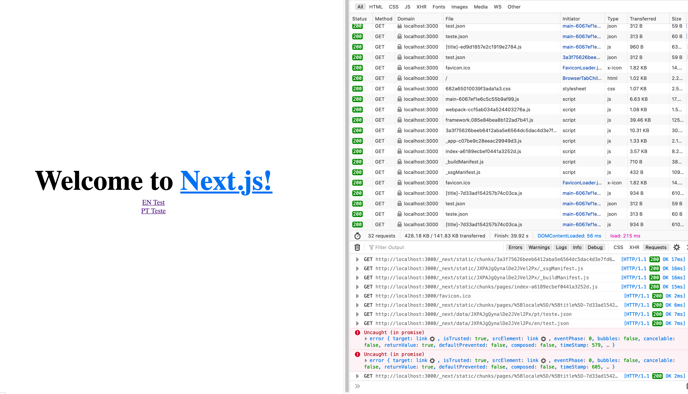

## Nextjs 9.5 Firefox Prefetch Exception

This repository is an example on how to reproduce the `Uncaught Exeception` error on Firefox caused by `Nextjs 9.5` prefetching. This behavior didn't exist in previous versions.

Basically, if you use prefetching on a dynamic route, for whatever reason, firefox throws an exception due to the prefetch `link` tag. It happens 100% of the times.

This is specifically annoying since it may trigger alerts on monitoring platforms such as `Sentry`. If you have enough links, it may even trigger rate limiting on these services.

Other than that, no major issues arise (the prefetching behavior works normally).

An example image is given below.



Sometimes the behavior is reproduceable on development mode. But a 100% of the times it is reproduceable on production builds.


### To reproduce:

1. Run

```bash
yarn install
yarn build
yarn start
```

2. Open https://localhost:3000 on firefox with the console open.
3. Check the errors on the console.